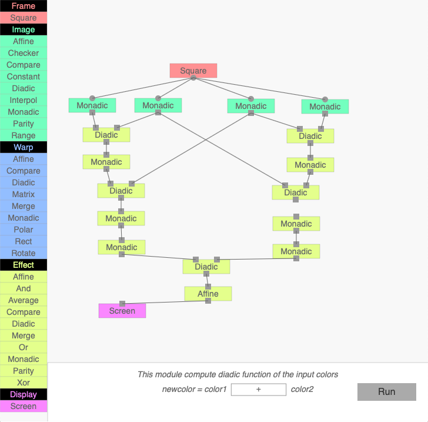
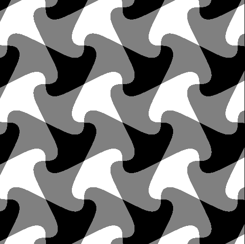
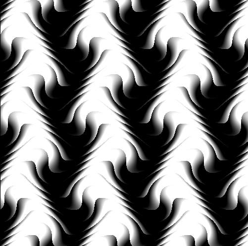

# filab
Fonctional Images

This little laboratory is inspired by Conal Elliot's paper
[Functional Images](http://conal.net/papers/functional-images/)

This is a port in javascript of an old java applet I wrote in 2009, given
that applets are more and more difficult to run in modern browsers.

## TERMINOLOGY

`filab` generates grayscale images, by defining a function (or a series of functions)
 from 2D space to gray level.

To achieve this, a graph is made of modules connected together.

There are 5 types of modules :

* Frame : the module generates the 2D points

* Warp : the module transform the 2D points

* Image : the module convert the 2D points into gray level

* Effect : the module transform the gray level

* Display : the module produces an image

A valid graph must start with at least one Frame module, and end with a Display module.

## USAGE

* To add a module to the graph, drag it from the palette (on the left)
to the work space.

* To set a link between two modules, click on one connector and drag a line to another one. Round connectors represent 2D points. Square connectors
represent gray level values. You can only set a link between connectors of the same nature.

* When the graph is ready, click the `Run` button.

## EXPORT

You can export the graph into a json file.

## IMPORT

You can import a json file, by dropping it to from the computer desktop to the workspace.

